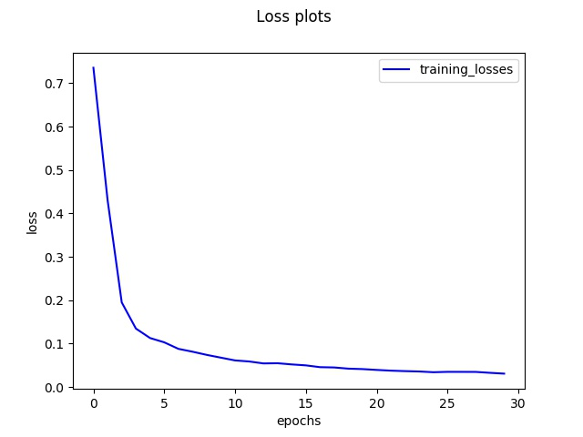

# Semantic Segmentation

This project is about labeling the pixels of a road from road scene images by semantic segmentation using Fully Convolutional Network(FCN). 


### Details on implementation
The FCN is build from pre trained VGG16 model and fine tuned.

The hyper parameters tuned are:
 - Learning rate: 0.00005
 - Epochs : 30
 - batch size : 8
 
 The training loss curve plot:
 
 
 
 The model is trained in AWS g3.4xlarge instance and took 1 hour.
 
 The sample road scene images from testing data: Road pixels are classified and colored as below;
 
 
 
 
 
 


### Setup
##### Frameworks and Packages
Make sure you have the following is installed:
 - [Python 3](https://www.python.org/)
 - [TensorFlow](https://www.tensorflow.org/)
 - [NumPy](http://www.numpy.org/)
 - [SciPy](https://www.scipy.org/)
##### Dataset
Download the [Kitti Road dataset](http://www.cvlibs.net/datasets/kitti/eval_road.php) from [here](http://www.cvlibs.net/download.php?file=data_road.zip).  Extract the dataset in the `data` folder.  This will create the folder `data_road` with all the training a test images.

### Start
##### Implement
Implement the code in the `main.py` module indicated by the "TODO" comments.
The comments indicated with "OPTIONAL" tag are not required to complete.
##### Run
Run the following command to run the project:
```
python main.py
```
**Note** If running this in Jupyter Notebook system messages, such as those regarding test status, may appear in the terminal rather than the notebook.

### Submission
1. Ensure you've passed all the unit tests.
2. Ensure you pass all points on [the rubric](https://review.udacity.com/#!/rubrics/989/view).
3. Submit the following in a zip file.
 - `helper.py`
 - `main.py`
 - `project_tests.py`
 - Newest inference images from `runs` folder
